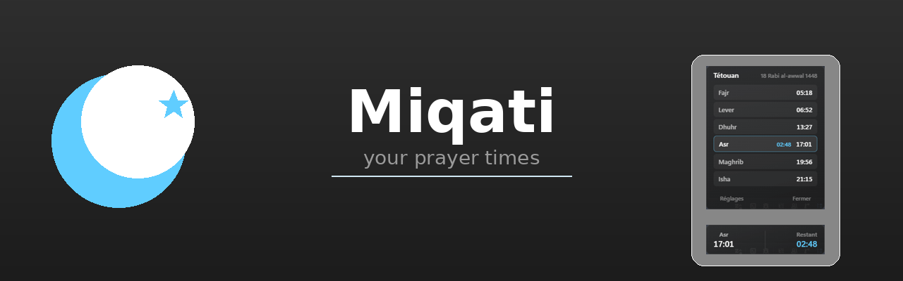
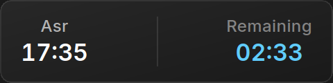
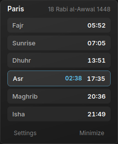
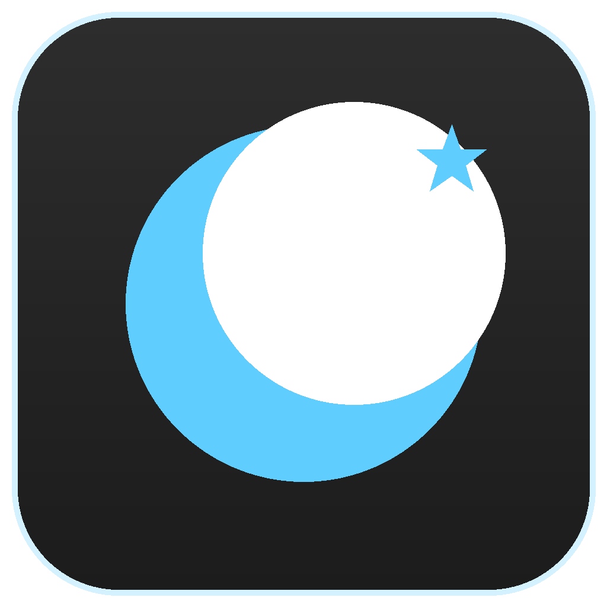

<p align="center">
  
</p>

<p align="center">
  <strong>Miqati</strong> &nbsp;·&nbsp; your prayer times, always on top of the Windows taskbar
</p>

<p align="center">
  
  
  
  
</p>

---

## ✨ Features

- **HUD widget** — compact and unobtrusive, always on top of your apps, without ever stealing focus.
- **Countdown** to the next prayer, updated every second.
- **Detail view**: today's prayer times + the **Hijri date**.
- **100 % offline**: times are computed locally, nothing is sent.
- **Auto-hide** in fullscreen (games, video) and automatic reappearance.
- **Automatic location** (detected on **first launch** or via "Use my location") with the **city timezone** (handles DST).
- **Auto-saved settings** and multilingual UI (English / Français / العربية).
- Optional **start with Windows**.

## 🖼️ Preview

<div align="center">
  
  <br><br>
  
</div>

## 🚀 Installation

Download the latest installer **`Miqati_x64-setup.exe`** from the [Releases](https://github.com/ismail-bahloul/Miqati/releases) page and run it. **No administrator rights required** (per-user install).

> ⚠️ The app is not code-signed yet — on first launch Windows may show **"More info → Run anyway"**. A signing certificate will remove this warning later.

## 🧭 Usage

- The widget shows the **next prayer** and the **time remaining**.
- **Click** the widget → **detail view** (prayers + sunrise + Hijri date).
- **Drag** the widget → move it (position is remembered; the tray menu "Dock to bar" snaps it back).
- **Tray icon**: left-click toggles show/hide, menu to re-dock or quit.

## ⚙️ Settings

- **City / coordinates**: type them manually or click **"Use my location"** (IP geolocation).
- **Calculation method**, **school (Asr)**, **high-latitude rule**.
- **Language** (en / fr / ar), **12/24 h format**.
- **Start with Windows**, **start hidden**.
- Every change is **applied automatically** — no "Save" button.

## 🛠️ Build from source

Prerequisites: [Rust](https://rustup.rs), a Windows toolchain and the [WebView2 runtime](https://developer.microsoft.com/microsoft-edge/webview2/) (preinstalled on Windows 11).

```bash
cargo build --release            # standalone binary
cargo tauri build                # + NSIS installer
```

## 📄 License

To be defined. — © Ismail Bahloul

---

<div align="center">
  
  <br>
  <sub>made with ❤️ for the community</sub>
</div>
