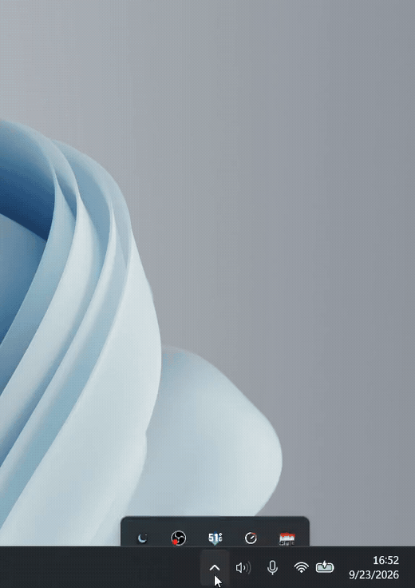

<p align="center">
  
</p>

<p align="center">
  Prayer times and a live countdown to the next salah, on your Windows taskbar.
</p>

<p align="center">
  <a href="https://github.com/ismail-bahloul/Miqati/releases/latest/download/Miqati_x64-setup.exe"><b>Download Miqati for Windows</b></a>
</p>

Miqati is a small widget that sits on your taskbar and shows the next prayer, with the time
left before it. Click it for today's times and the Hijri date. It never steals the focus
from what you are doing, and it does every calculation on your own machine: no account, no
server, no tracking.

## Preview

<table align="center">
<tr>
<td align="center">
  <br><br>
  
</td>
<td align="center">
  
</td>
</tr>
</table>

## Install

1. Click **Download Miqati for Windows** above, or open the
   [latest release](https://github.com/ismail-bahloul/Miqati/releases/latest) to read the
   notes first.
2. Run the installer. Windows may ask you to confirm it.
3. Miqati starts right away and puts an icon in the notification area, next to the clock.

It runs on Windows 10 and 11 and needs no administrator rights. There is nothing to
configure before you start: on first launch Miqati works out your city from your connection,
and you can change it later in the settings.

> **Windows may warn you the first time.** SmartScreen shows a "Windows protected your PC"
> prompt for any program it has not seen before. Click **More info**, then **Run anyway**.
> More on this under [Code signing](#code-signing).

## Using Miqati

- **Click the widget** to open today's times. Click again to close them.
- **Drag it** to move it. The tray menu can snap it back onto the taskbar.
- **Right-click the tray icon** to show or hide the widget, re-dock it, or quit.
- **Reminders** can pop a notification before each prayer, at the time of the prayer, or
  both. They only fire from the installed version, and only if you turn them on.

## Settings

The settings open from the detail view, with the everyday options first:

- **City.** Type a name and pick it from the list, which covers more than 12 000 cities and
  towns, Morocco's included, or use the magnifier to detect where you are.
- **Language**, in French, English or Arabic, and the **time format**, 12 or 24 hours.
- **Reminders**, and how long before a prayer they should appear.

Under "Advanced" you will find the coordinates, the calculation method, the Asr school, the
high latitude rule and the timezone, if you want to match your local mosque's timetable.
Everything saves as you change it.

## Your privacy

Times are computed locally, and nothing about you is sent anywhere. Two requests can leave
your machine, and **Offline mode** turns both off, after which the app makes no network
request at all:

- the optional city detection, which asks `ip-api.com` for a city matching your IP address;
- an update check, which only reads public release information from GitHub.

[PRIVACY.md](PRIVACY.md) has the details, including which of the two is encrypted.

## Something not working?

| What you see | What to do |
|---|---|
| Windows warned me about the app | That is SmartScreen. See [Install](#install). |
| No reminder notifications | They only fire from the installed version, and only if they are enabled. |
| The times look wrong for my city | Check the calculation method and the timezone under "Advanced". The magnifier re-detects your city and its method. |
| Something else | [Open an issue](https://github.com/ismail-bahloul/Miqati/issues) with your Windows version and what you expected. A screenshot helps; there's no need to share your city or exact location, just mention it if it's relevant to the bug. |

## Verifying the download

Every release ships a `SHA256SUMS.txt`, and the installer carries an attestation tying it to
this repository's build. It is published twice under the same digest: `Miqati_x64-setup.exe`
(what the button above downloads) and a copy carrying the version number.

```bash
gh attestation verify Miqati_x64-setup.exe -R ismail-bahloul/Miqati
```

The same SHA-256s let you look a build up on [VirusTotal](https://www.virustotal.com/), if you
want other scanners' opinion on it.

## Code signing

The installers are not signed yet, which is why SmartScreen warns the first time you run
one. Signing them through the [SignPath Foundation](https://signpath.org/), which offers it
free to open-source projects, is planned.

## Building from source

You need [Rust](https://rustup.rs), a Windows toolchain and the
[WebView2 runtime](https://developer.microsoft.com/microsoft-edge/webview2/).

```bash
cargo tauri dev     # run it
cargo tauri build   # build the installer, under target/release/bundle/nsis/
```

## License

Miqati is released under the [GPL-3.0](LICENSE) license. Free and open source.
© Ismail Bahloul

The prayer times come from `salaat-core`, a port of the GPL-3.0
[`salaatprayertime`](https://github.com/MazenMohamed203/salaatprayertime) KDE widget. The
city list is derived from [GeoNames](https://www.geonames.org/), under
[CC BY 4.0](https://creativecommons.org/licenses/by/4.0/).
